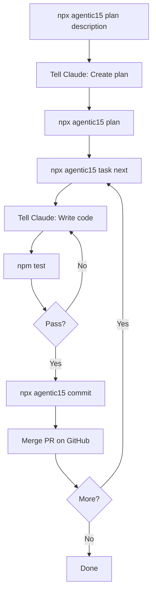

# Agentic15 Claude Zen

> **AI-Assisted Development Framework with Automated Workflows**

[](https://opensource.org/licenses/Apache-2.0)
[](https://www.npmjs.com/package/@agentic15.com/agentic15-claude-zen)

Task-driven development framework for Claude Code with automated testing, commits, and pull requests.

---

## Quick Start

```bash
# Create project
npx @agentic15.com/agentic15-claude-zen my-project
cd my-project

# Setup GitHub
npx agentic15 auth

# Start building
npx agentic15 plan "Build a todo app"
```

**See [WORKFLOWS.md](WORKFLOWS.md) for complete step-by-step workflows with diagrams.**

---

## What You Get

### Human Commands (5 total)
- `npx agentic15 plan` - Generate and lock plans
- `npx agentic15 task next` - Start next task
- `npx agentic15 commit` - Test + commit + push + PR
- `npx agentic15 status` - Check progress
- `npm test` - Run tests

### Claude Writes Code
- Reads task requirements from `.claude/plans/`
- Writes code in `Agent/src/`
- Writes tests in `Agent/tests/`
- That's it - no git commands, no CLI

### CLI Automates Everything Else
- Creates feature branches (`feature/task-001`)
- Generates commit messages (`[TASK-001] Task title`)
- Pushes to GitHub
- Creates pull requests
- Updates GitHub issues

---

## Complete Workflow (9 Steps)



1. `npx agentic15 plan "Build feature"`
2. Tell Claude: "Create the project plan"
3. `npx agentic15 plan`
4. `npx agentic15 task next`
5. Tell Claude: "Write code for TASK-001"
6. `npm test`
7. `npx agentic15 commit`
8. Merge PR on GitHub
9. Repeat 4-8 for each task

**See [WORKFLOWS.md](WORKFLOWS.md) for UI testing and bug fix workflows.**

---

## Visual Testing (Optional)

UI projects get automated visual regression testing:

```bash
# Setup (first time)
npm install --save-dev @playwright/test
npx playwright install chromium

# Test UI
npx playwright test

# If tests fail
node .claude/hooks/post-visual-test.js
# Tell Claude: "Read visual test report and fix"
# Repeat until passing
```

Claude sees screenshots and fixes UI issues automatically.

---

## Project Structure

```
my-project/
├── .claude/              # Framework config
│   ├── plans/            # Project plans and tasks
│   ├── hooks/            # Automation hooks
│   └── settings.json     # Claude permissions
├── Agent/                # Your workspace
│   ├── src/              # Source code
│   └── tests/            # Test files
├── package.json
└── README.md
```

---

## Clear Responsibilities

| Who | Does What |
|-----|-----------|
| **Human** | Runs `npx agentic15` commands<br>Runs `npm test`<br>Merges PRs on GitHub |
| **Claude** | Reads task files<br>Writes code in `Agent/`<br>Writes tests<br>Fixes bugs |
| **CLI** | Creates branches<br>Generates commits<br>Pushes to GitHub<br>Creates PRs<br>Updates issues |

---

## Features

✅ **Zero Config** - Just provide GitHub token once
✅ **Auto-Generated Commits** - `[TASK-001] Task title` format
✅ **Feature Branch Workflow** - PRs required, no direct-to-main
✅ **Visual Testing Feedback** - Claude sees screenshots and fixes UI
✅ **Framework Agnostic** - React, Vue, Angular, Svelte, etc.
✅ **GitHub Integration** - Auto-creates issues and PRs

---

## Documentation

- **[WORKFLOWS.md](WORKFLOWS.md)** - Complete workflows with mermaid diagrams
- **[CHANGELOG.md](CHANGELOG.md)** - Version history and release notes

---

## Requirements

- Node.js 18+
- Git installed
- GitHub account (for PR workflow)
- GitHub CLI (`gh`) for PR creation

---

## Contributing

We welcome contributions! See [CONTRIBUTING.md](CONTRIBUTING.md) for guidelines.

---

## License

Copyright 2024-2025 agentic15.com

Licensed under the Apache License, Version 2.0. See [LICENSE](LICENSE) for full text.

---

## Support

- **Issues**: https://github.com/agentic15/claude-zen/issues
- **Email**: support@agentic15.com
- **Website**: https://agentic15.com

---

**"AI-Assisted Development That Just Works"**
