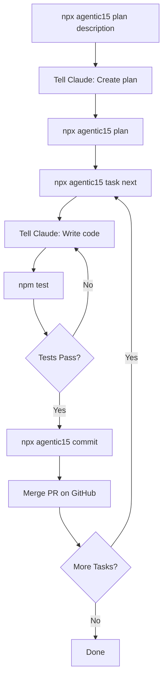
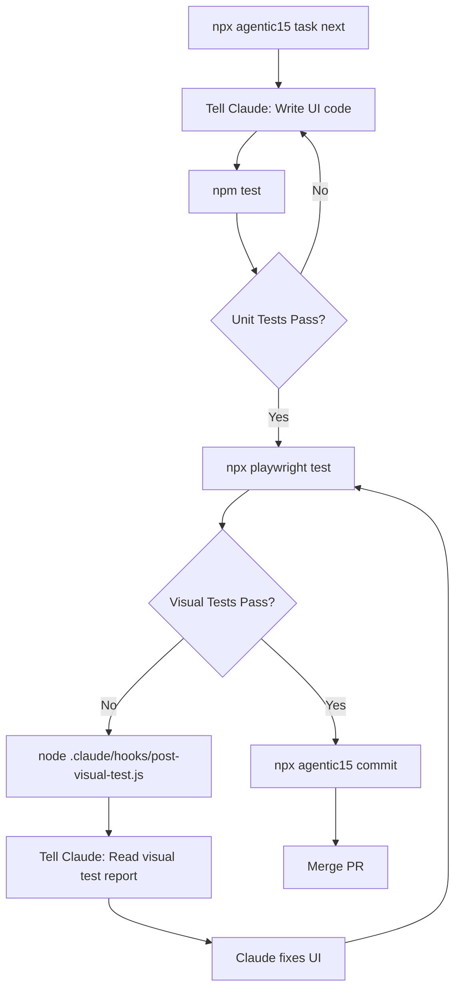
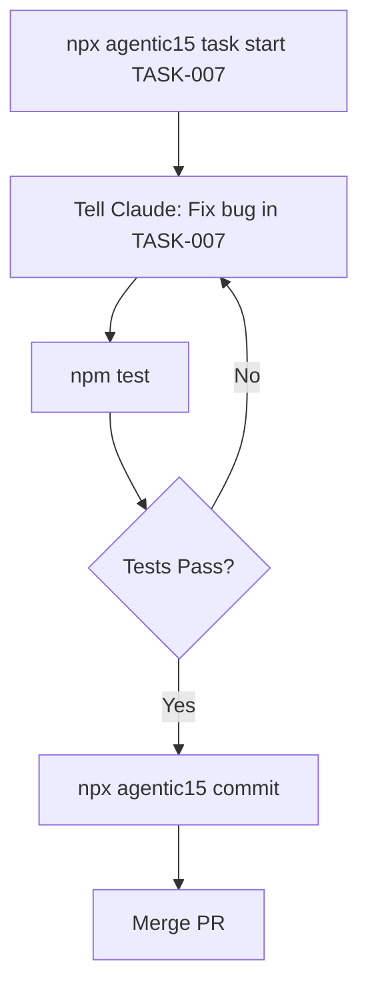

# Agentic15 Workflows

## Setup (One Time)

```bash
# Bash/Mac/Linux
npx @agentic15.com/agentic15-claude-zen my-project

# PowerShell (Windows)
npx "@agentic15.com/agentic15-claude-zen" my-project

# Then
cd my-project
npx agentic15 auth
```

---

## Main Development Loop



**Commands:**
1. `npx agentic15 plan "Build todo app"`
2. Tell Claude: "Create the project plan"
3. `npx agentic15 plan`
4. `npx agentic15 task next`
5. Tell Claude: "Write code for TASK-001"
6. `npm test`
7. `npx agentic15 commit`
8. Merge PR on GitHub
9. Repeat 4-8 for each task

---

## UI Development with Visual Testing



**Commands:**
1. `npx agentic15 task next`
2. Tell Claude: "Write code for TASK-XXX"
3. `npm test`
4. `npx playwright test`
5. If fail: `node .claude/hooks/post-visual-test.js`
6. Tell Claude: "Read visual test report and fix"
7. Repeat 4-6 until pass
8. `npx agentic15 commit`
9. Merge PR on GitHub

---

## Bug Fix Workflow



**Commands:**
1. `npx agentic15 task start TASK-007`
2. Tell Claude: "Fix the bug in TASK-007"
3. `npm test`
4. `npx agentic15 commit`
5. Merge PR on GitHub

---

## Check Progress

```bash
npx agentic15 status
```

Shows:
- Current task
- Completed tasks
- Pending tasks
- Progress percentage
- Modified files

---

## Visual Testing Setup (First Time)

```bash
npm install --save-dev @playwright/test
npx playwright install chromium
# After Claude writes visual tests:
npx playwright test --update-snapshots
```

---

## Command Reference

| Command | What It Does |
|---------|--------------|
| `npx agentic15 auth` | Setup GitHub token |
| `npx agentic15 plan "desc"` | Generate plan requirements |
| `npx agentic15 plan` | Lock plan, create tasks |
| `npx agentic15 task next` | Start next pending task |
| `npx agentic15 task start TASK-XXX` | Start specific task |
| `npx agentic15 commit` | Test + commit + push + PR |
| `npx agentic15 status` | Show progress |
| `npm test` | Run unit tests |
| `npx playwright test` | Run visual tests |

---

## Responsibilities

**Human:**
- Runs `npx agentic15` commands
- Runs `npm test` and `npx playwright test`
- Merges PRs on GitHub

**Claude:**
- Reads task files
- Writes code in `Agent/src/`
- Writes tests in `Agent/tests/`
- Fixes bugs and UI issues

**CLI:**
- Creates feature branches
- Generates commits
- Pushes to GitHub
- Creates PRs
- Updates issues
